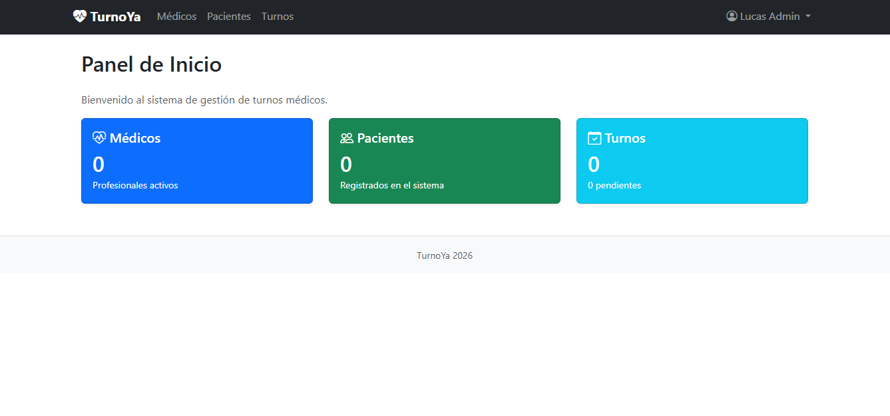
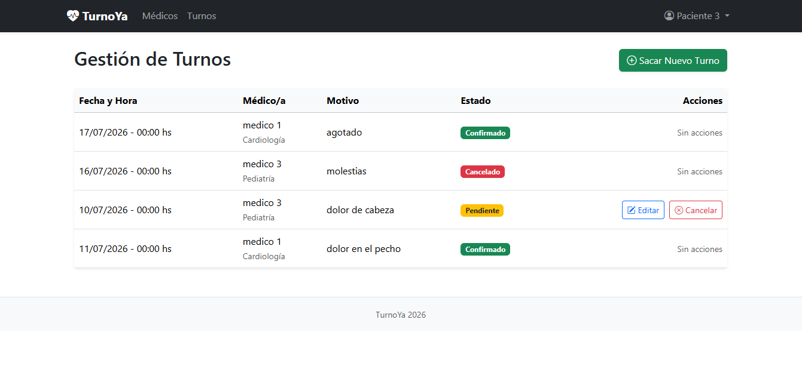
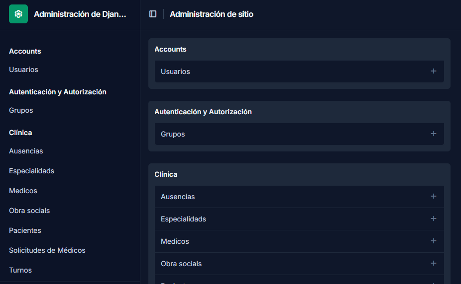
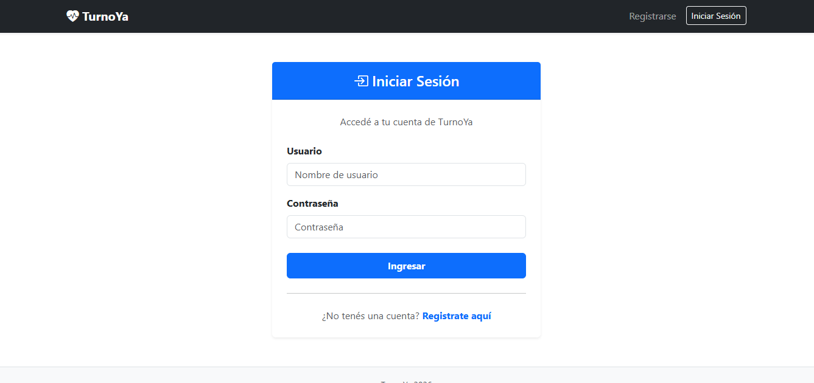

# TurnoYa 🏥

Sistema web de gestión de turnos médicos desarrollado con Django 5.1+.  
Permite registrar médicos, pacientes y turnos, con autenticación de usuarios y panel de administración.

---

## 🛠️ Stack

| Tecnología | Versión |
|------------|---------|
| Python | 3.13+ |
| Django | 5.1+ |
| Base de datos | SQLite (desarrollo) |
| Frontend | Bootstrap 5 |
| Tests | `django.test.TestCase` |
| Control de versiones | Git + GitHub |

---

## ✨ Funcionalidades

- 🔐 Registro, login y logout de usuarios
- 👨‍⚕️ Gestión de médicos y especialidades
- 🧑 Gestión de pacientes
- 📅 Solicitud, confirmación y cancelación de turnos
- 📊 Panel de inicio con estadísticas del día
- 🛠️ Panel de administración Django configurado
- 📱 Interfaz responsiva con Bootstrap 5

---

## 👥 Integrantes

| Nombre | Usuario GitHub |
|--------|---------------|
| Lucas Rodríguez | [LucasJRz03](https://github.com/LucasJRz03) |
| Cristian Acho | [cbacristian](https://github.com/cbacristian) |
| ... | [@usuario](https://github.com/usuario) |
s
---

## 🚀 Instalación y uso

### 1. Clonar el repositorio

```bash
git clone https://github.com/usuario/turnoya.git
cd turnoya
```

### 2. Crear y activar el entorno virtual

```bash
# Windows
python -m venv .venv
.\.venv\Scripts\Activate.ps1

# macOS / Linux
python3 -m venv .venv
source .venv/bin/activate
```

### 3. Instalar dependencias

```bash
pip install -r requirements.txt
```

### 4. Aplicar migraciones

```bash
python manage.py migrate
```

### 5. Crear superusuario (para el panel admin)

```bash
python manage.py createsuperuser
```

### 6. Correr el servidor de desarrollo

```bash
python manage.py runserver
```

Accedé a [http://localhost:8000](http://localhost:8000)  
Panel admin: [http://localhost:8000/admin](http://localhost:8000/admin)

---

## 🧪 Correr los tests

```bash
# Todos los tests con detalle
python manage.py test -v 2

# Solo tests de modelos
python manage.py test app.tests.test_models -v 2

# Solo tests de vistas
python manage.py test app.tests.test_views -v 2
```

---

## 🔑 Credenciales de prueba

> ⚠️ Solo para uso del corrector en entorno de desarrollo local.

| Rol | Usuario | Contraseña |
|-----|---------|-----------|
| Superusuario / Admin | `admin` | `admin1234` |
| Usuario de prueba | `usuario_prueba` | `prueba1234` |

---

## 📁 Estructura del proyecto

```
turnoya/
├── turnoya/            # Configuración del proyecto Django
│   ├── settings.py
│   └── urls.py
├── app/                # App principal
│   ├── models.py       # Especialidad, Medico, Paciente, Turno
│   ├── views.py
│   ├── urls.py
│   ├── forms.py
│   ├── admin.py
│   ├── consultas.py    # Consultas ORM
│   └── tests/
│       ├── test_models.py
│       └── test_views.py
├── templates/
│   ├── base.html
│   └── registration/
├── static/
├── manage.py
├── requirements.txt
└── .gitignore
```

---

## 🖼️ Capturas

### Inicio


### Lista de turnos


### Panel de administración


### Login


---

## 🧩 Decisiones de diseño

> *(Mínimo 200 palabras — completar antes de la entrega final)*

Describir aquí:
- Por qué eligieron este dominio

- Cómo organizaron las responsabilidades entre modelos y vistas
Implementamos un patrón estricto y unificado en todos los modelos: validate(), new() y update().
Modelos: Son el núcleo de la lógica. validate es un @classmethod que retorna una lista de errores sin tocar la base de datos. new y update dependen de él para garantizar la integridad.
Vistas: Utilizamos exclusivamente CBVs (Class-Based Views). Para respetar nuestro patrón de modelos, sobrescribimos el método form_valid() en las CreateView y UpdateView. En lugar de usar el form.save() nativo de Django, extraemos los datos limpios y llamamos manualmente a Modelo.new() o instancia.update(), inyectando los errores de vuelta al formulario con form.add_error() si algo falla.

Ademas, diseñamos un CustomUser (heredando de AbstractUser) que actúa como el núcleo de autenticación. Los perfiles de Paciente y Medico se vinculan mediante OneToOneField. Para el cambio de rol, creamos el modelo SolicitudMedico, que permite a un paciente solicitar ser médico, quedando en estado "Pendiente" hasta que un Administrador lo apruebe desde el panel (usando acciones personalizadas de Django), lo que automáticamente crea el perfil de Medico y actualiza el rol del usuario.

- Qué validaciones decidieron poner en el modelo vs. en el formulario
El modelo es la única fuente de verdad. Las validaciones de negocio (ej. que un turno no se superponga, que el DNI sea numérico, que la fecha no sea pasada) viven en el validate() del modelo. Los formularios (forms.py) se encargan de la validación de formato, de inyectar las clases de Bootstrap 5 para la UI, y de actuar como puente: si el modelo rechaza los datos, el formulario los muestra al usuario.

- Cómo dividieron el trabajo entre los integrantes

Lucas Rodríguez: Se enfocó en la arquitectura de los modelos (Medico, Paciente, Ausencia, ObraSocial), el patrón validate/new/update con @classmethod y **kwargs, las vistas de gestión de turnos (cancelar, confirmar), y la lógica de superposición horaria. También desarrolló los tests unitarios de los modelos y views de la app principal. También configuró el panel de administración con django-unfold y las acciones personalizadas para aprobar/rechazar solicitudes.
Cristian Acho: Desarrolló el sistema de autenticación (CustomUser, Login, Logout, Registro), el perfil de usuario con la lógica de SolicitudMedico y el formulario de paciente, y el diseño de los templates de la app accounts con Bootstrap 5 (Navbar dinámica, tarjetas, tablas responsivas, manejo de errores). Laas vistas de gestión de turnos (nuevo, editar)

- Cualquier decisión de diseño no obvia (ej: por qué usaron FBV en lugar de CBV, cómo manejaron la relación User ↔ Paciente, etc.)

Método update con **kwargs: En lugar de argumentos explícitos, usamos **kwargs combinado con un diccionario datos_futuros. Esto nos permite actualizar solo los campos que cambian, facilitando el mantenimiento si en el futuro agregamos nuevos campos a los modelos.
Exclusión de PK en validaciones (exclude_pk): En modelos con campos únicos o reglas de superposición (como Turno o SolicitudMedico), pasamos el pk de la instancia actual al validate() para evitar "falsos positivos" (que el sistema te impida guardar un turno porque "ya existe uno igual", cuando en realidad es el que estás editando).
Panel Admin con django-unfold: Elegimos esta librería para ofrecer un panel de administración moderno, responsivo y con mejor UX para los administradores, incluyendo dashboards y acciones en lote.
Protección de vistas con Mixins: Usamos LoginRequiredMixin para vistas que requieren autenticación, y UserPassesTestMixin para vistas que requieren roles específicos (como la lista de pacientes, que solo es visible para administradores).

---

## ⭐ Funcionalidades opcionales implementadas

- [ ] Vista "Mis turnos" para el paciente autenticado
- [ ] Mensajes flash con `django.contrib.messages`
- [ ] Paginación en lista de turnos
- [ ] Permisos diferenciados por grupo
- [ ] Tests de integración (flujo completo)

---

## 🐛 Problemas comunes

| Problema | Solución |
|----------|----------|
| `OperationalError: no such table` | Corré `python manage.py migrate` |
| `No module named django` | Activá el entorno virtual |
| Página en blanco o error 500 | Revisá la consola donde corre `runserver` |
| Login no redirige bien | Verificá `LOGIN_REDIRECT_URL` en `settings.py` |